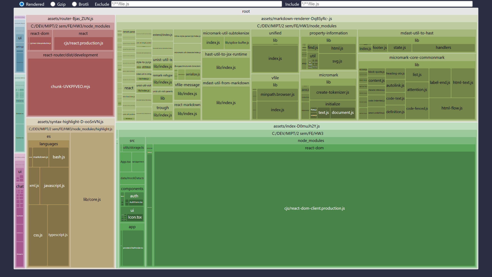

# GigaChat UI Shell

Frontend-клиент чата на React + TypeScript + Vite. Приложение поддерживает несколько диалогов, глобальный store на `Context + useReducer`, маршруты `"/"` и `"/chat/:id"`, markdown-рендеринг ответов, потоковую генерацию, светлую и тёмную темы, тесты и production-оптимизации.

## Демо

Публичная ссылка на развёрнутое приложение: пока не добавлена в этот репозиторий.

Скриншоты или видео-запись работы: добавьте после публикации приложения.
Рекомендуемые артефакты:

- `docs/demo-auth.png` — экран fallback-авторизации;
- `docs/demo-chat.png` — основной экран чата;
- `docs/demo-mobile.png` — мобильный вид интерфейса

## Стек

- React `19.0.0`
- TypeScript `5.8.0`
- Vite `7.0.0`
- React Router DOM `7.13.2`
- State management: `Context API + useReducer`
- Стилизация: `CSS Modules + CSS variables`
- Markdown rendering: `react-markdown 9.0.1`
- Подсветка кода: `highlight.js 11.11.1`
- Тесты: `Vitest 4.1.4` + `React Testing Library`

## Запуск локально

1. Клонировать репозиторий:

```bash
git clone https://github.com/DrozdovNikolai/mipt-fe-fundamentals-template.git
cd mipt-fe-fundamentals-template
```

2. Установить зависимости:

```bash
npm install
```

3. Создать `.env.local` на основе `.env.example`:

```bash
cp .env.example .env.local
```

4. Заполнить `.env.local` своими значениями:

```env
VITE_GIGACHAT_CREDENTIALS=your_base64_credentials
VITE_GIGACHAT_SCOPE=GIGACHAT_API_PERS
```

5. Запустить приложение:

```bash
npm run dev
```

6. При необходимости проверить production-сборку локально:

```bash
npm run build
npm run preview
```

Если `VITE_GIGACHAT_CREDENTIALS` и `VITE_GIGACHAT_SCOPE` не заданы, приложение переключается в fallback-режим и позволяет ввести `credentials` и `scope` через UI.

## Переменные окружения

| Переменная | Обязательность | Описание |
| --- | --- | --- |
| `VITE_GIGACHAT_CREDENTIALS` | Нет | Base64 credentials для получения access token GigaChat API. Если не задана, можно войти через UI fallback-форму. |
| `VITE_GIGACHAT_SCOPE` | Нет | Scope для GigaChat API. Поддерживаемые значения: `GIGACHAT_API_PERS`, `GIGACHAT_API_B2B`, `GIGACHAT_API_CORP`. Если не задана, можно выбрать scope в UI fallback-форме. |

## Скрипты

- `npm run dev` — локальная разработка.
- `npm run build` — production build.
- `npm run preview` — локальный preview production-сборки.
- `npm run build:analyze` — анализ production-бандла через `vite-bundle-visualizer`.
- `npm test` — запуск unit/component тестов через Vitest.

## Что Оптимизировано

- `Sidebar`, `SettingsPanel` и route-компоненты загружаются через `React.lazy + Suspense`.
- `react-markdown` и `highlight.js` вынесены в отдельные чанки `markdown-renderer` и `syntax-highlight`, не попадают в основной bundle.
- `ChatItem` обёрнут в `React.memo`.
- Для фильтрации списка чатов используется `useMemo`.
- Обработчики, передаваемые в дочерние компоненты, стабилизированы через `useCallback`.
- Область сообщений изолирована через `ErrorBoundary`, ошибки API показываются под полем ввода с кнопкой `Повторить`.

## Аудит Бандла

Отчёт `vite-bundle-visualizer` сохраняется в [docs/bundle-report.html](docs/bundle-report.html), скриншот — в [docs/bundle-report.png](docs/bundle-report.png).

Основные тяжёлые зависимости в сборке:

- `react-markdown` и его markdown-экосистема;
- `highlight.js`;
- `react-router`.

После разбиения на чанки тяжёлые markdown/syntax зависимости загружаются отдельно от основного чанка приложения.



## Тесты

Тесты написаны на `Vitest` и `React Testing Library`.

Покрыты ключевые части:

- reducer глобального chat-store;
- контролируемая форма `InputArea`;
- варианты отображения `Message`;
- поиск и подтверждение удаления в `Sidebar`;
- сохранение и восстановление данных через `localStorage`, включая битый JSON.

Запуск:

```bash
npm test
```
